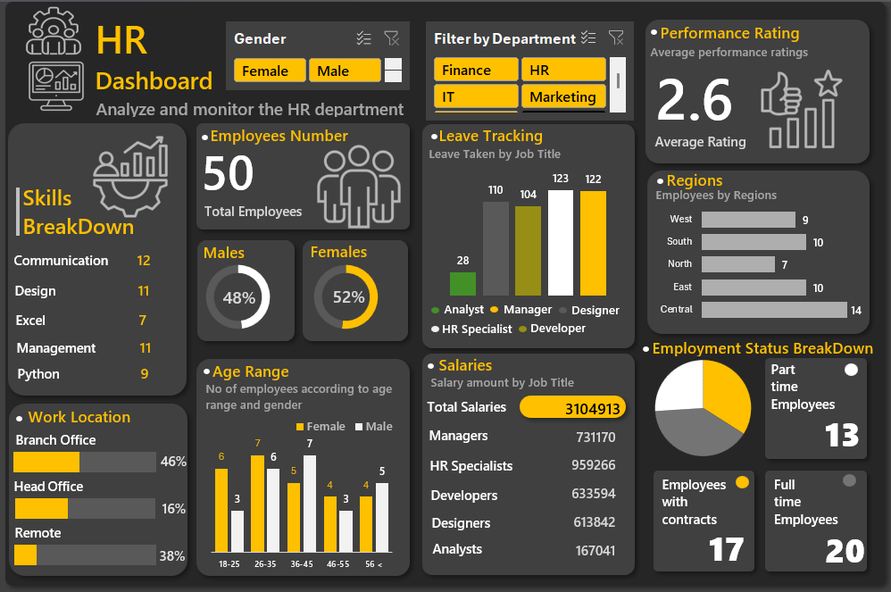

# 🧑‍💼 HR Analytics Dashboard | Microsoft Excel

An interactive **HR Analytics Dashboard** built in **Microsoft Excel** to transform raw HR data into meaningful business insights. This project demonstrates data cleaning, analysis, visualization, and dashboard development using Excel's advanced features such as Pivot Tables, Pivot Charts, Slicers, Conditional Formatting, and KPI Cards.

---

# 📸 Dashboard Preview



---

# 📖 Project Overview

Human Resource departments generate large volumes of employee data that can be difficult to analyze manually. This dashboard provides a centralized view of key HR metrics, helping organizations monitor workforce performance, employee demographics, salary distribution, skills, work locations, and employment status.

The dashboard is fully interactive and allows users to filter data dynamically using slicers, making HR reporting faster, more accurate, and easier to understand.

---

# 🎯 Project Objectives

The primary objectives of this project are:

- Analyze workforce demographics
- Monitor employee performance
- Compare gender distribution
- Track employee leave by job role
- Analyze salary distribution across job titles
- Monitor employment status
- Visualize work location distribution
- Identify employee skill distribution
- Analyze employee age groups
- Create an interactive HR reporting dashboard

---

# 📂 Dataset Information

The dataset contains HR employee records with the following information:

- Employee ID
- Employee Name
- Gender
- Age
- Department
- Job Title
- Salary
- Performance Rating
- Leave Taken
- Region
- Work Location
- Employment Status
- Skills

**Dataset File**

```
HR Data.xlsx
```

---

# 📊 Dashboard Features

## 👥 Employee Overview

- Total Employees
- Male Employees
- Female Employees

---

## ⭐ Performance Rating

Displays the average employee performance rating.

**Average Rating:** 2.6

---

## 🏢 Department Filter

Interactive slicer to filter employees by department.

Departments include:

- Finance
- HR
- IT
- Marketing

---

## 🚻 Gender Filter

Interactive slicer allowing users to filter dashboard by:

- Male
- Female

---

## 📅 Leave Tracking

Displays leave taken according to different job titles.

Job Roles:

- Analyst
- Manager
- Designer
- HR Specialist
- Developer

---

## 🌍 Regional Analysis

Shows employee distribution across different regions.

Regions:

- West
- South
- North
- East
- Central

---

## 💰 Salary Analysis

Displays total salary distribution according to job titles.

Job Titles:

- Managers
- HR Specialists
- Developers
- Designers
- Analysts

---

## 🎯 Employment Status Breakdown

Displays employee distribution according to employment type.

Includes:

- Full-Time Employees
- Part-Time Employees
- Contract Employees

---

## 💡 Skills Breakdown

Displays the number of employees having different professional skills.

Skills Included:

- Communication
- Design
- Excel
- Management
- Python

---

## 🏢 Work Location Analysis

Displays employees according to their work locations.

Locations:

- Branch Office
- Head Office
- Remote

---

## 👶 Age Group Analysis

Analyzes employees according to different age groups.

Age Categories:

- 18–25
- 26–35
- 36–45
- 46–55
- 56+

---

# 📈 Key Performance Indicators (KPIs)

| KPI | Value |
|------|-------|
| Total Employees | 50 |
| Average Performance Rating | 2.6 |
| Male Employees | 48% |
| Female Employees | 52% |
| Full-Time Employees | 20 |
| Contract Employees | 17 |
| Part-Time Employees | 13 |

---

# 🛠️ Tools & Technologies Used

- Microsoft Excel
- Pivot Tables
- Pivot Charts
- Slicers
- Conditional Formatting
- Data Validation
- KPI Cards
- Dashboard Design
- Data Visualization

---

# 🔧 Excel Features Used

- Pivot Tables
- Pivot Charts
- Interactive Slicers
- Donut Charts
- Column Charts
- Bar Charts
- KPI Cards
- Conditional Formatting
- Data Formatting
- Dashboard Layout Design

---

# 📊 Business Insights

Some important insights generated from the dashboard include:

- Total workforce consists of **50 employees**.
- Female employees slightly outnumber male employees.
- Average employee performance rating is **2.6**.
- Most employees are working as Full-Time staff.
- Salary distribution varies significantly across job titles.
- Employee skills are distributed across Communication, Design, Excel, Management, and Python.
- Interactive filters enable department-wise and gender-wise HR analysis.
- Regional employee distribution helps understand workforce allocation.

---

# 💼 Business Value

This dashboard helps HR teams to:

- Monitor employee performance
- Track workforce demographics
- Analyze salary distribution
- Improve workforce planning
- Support HR decision-making
- Generate interactive HR reports
- Reduce manual reporting efforts

---

# 🚀 Skills Demonstrated

Through this project, the following skills were demonstrated:

- Data Cleaning
- Data Preparation
- Data Analysis
- Dashboard Design
- KPI Development
- Business Intelligence
- HR Analytics
- Pivot Table Analysis
- Data Visualization
- Excel Reporting
- Analytical Thinking
- Problem Solving

---

# 📁 Project Structure

```
HR-Dashboard-and-Analysis/
│
├── Dashboard.png
├── HR Data.xlsx
├── README.md
└── LICENSE
```

---

# 📷 Project Files

| File | Description |
|------|-------------|
| Dashboard.png | Dashboard Screenshot |
| HR Data.xlsx | HR Dataset |
| README.md | Project Documentation |

---

# 🎯 Future Improvements

Possible future enhancements include:

- Power BI version of the dashboard
- Automated data refresh
- Advanced KPI tracking
- Employee attrition analysis
- Hiring trend analysis
- Department-wise performance analysis
- Attendance dashboard
- HR forecasting
- Integration with SQL database

---

# 👨‍💻 Author

## Vivek Bhatt

**Aspiring Data Analyst**

📍 Bageshwar, Uttarakhand, India

📧 Email: vb7830149108@gmail.com

🔗 LinkedIn:
https://www.linkedin.com/in/vivek-bhatt-data-analytics

💻 GitHub:
https://github.com/vivekbhatt2214

---

# ⭐ If you found this project useful

If you like this project, don't forget to ⭐ star the repository and share your feedback!

---

## 📜 License

This project is licensed under the MIT License.
